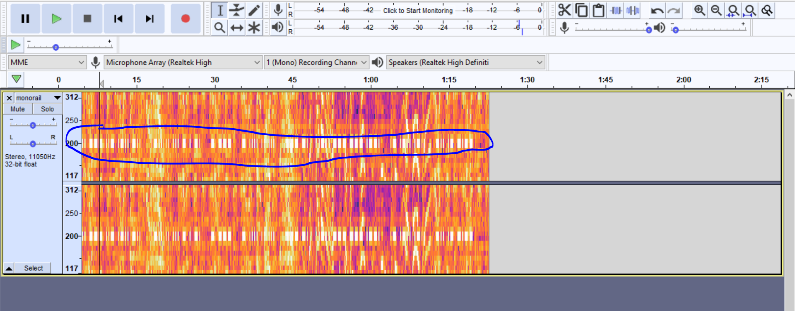

# Challenge
Do the loop doop doop...

Flag format: The STRING you end up with after solving challenge, case insensitive.  
  
# Setup
Audio file: [monorail.wav](monorail.wav)

# Solution
When listening to the audio file, we can hear an unusual periodic beeping sound in the background. The lengths of the beeps seem to alternate between short and long, and so our first intuition should be morse code.  
  
After opening this file in Audacity and analysing the spectrogram, we can see a series of short "dots" and "dashes" around the 1000Hz mark. If we slow down the speed by a factor of 5, these move to a frequency of 200Hz:

To better listen in this range for the morse code signals, we can set a high pass filter at 150Hz and a low pass one at 250Hz. After compiling the dots, dashes, short breaks and long breaks and converting it from morse code to english text, we get the string "i could listen to this on loop all day", which is our solution.
