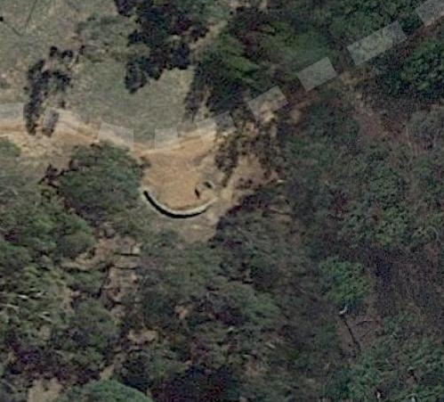
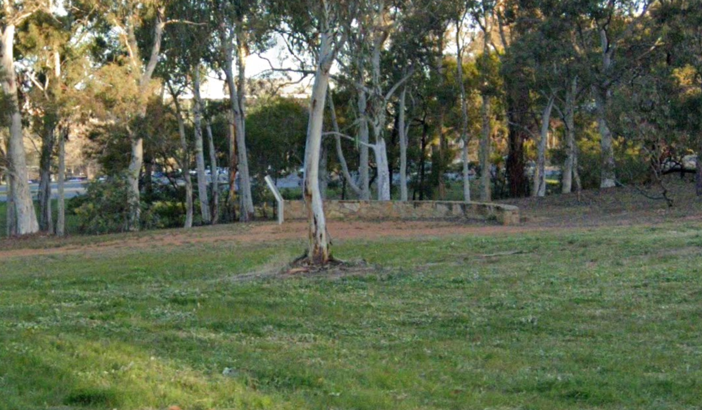
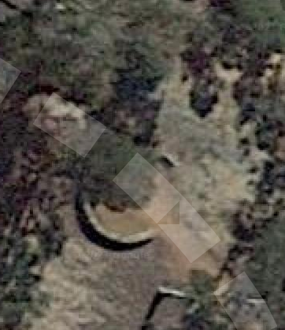
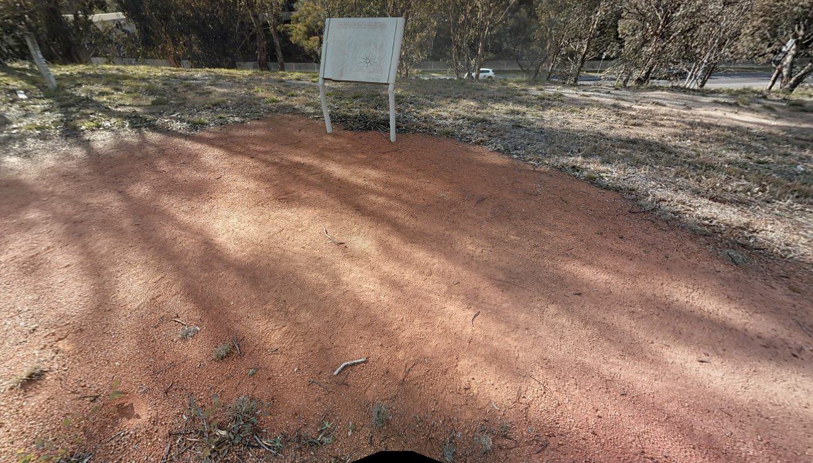
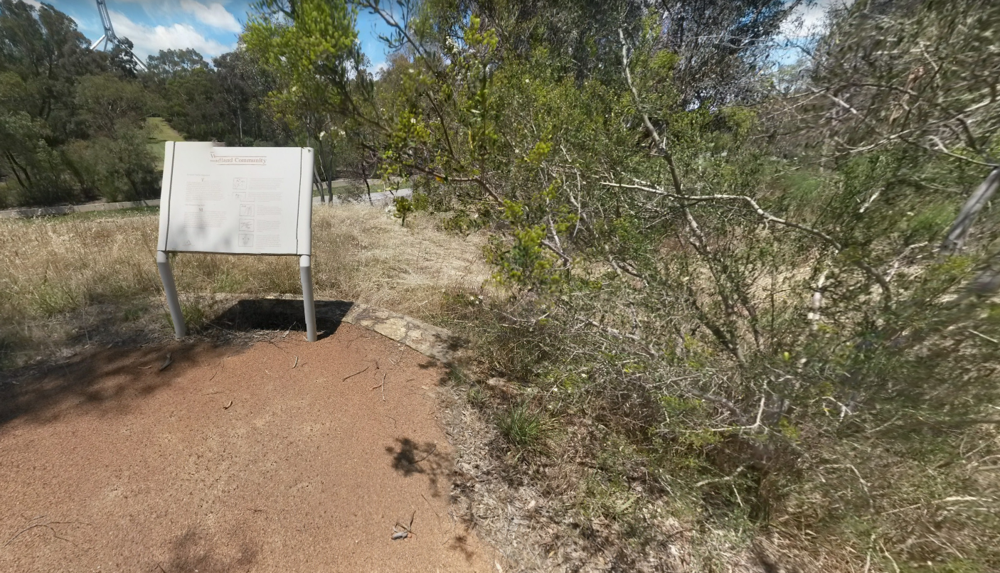

# Heart of the Nation

## Steps
The challenge description gave a few hints
> “Right at the heart of the nation, no piece of the bush inside the circle remains untouched by us".
> We believe this is one of their meeting places

This gives a few useful hints. It points towards Canberra, as it is an Aboriginal word for metting place, and can be considered the "heart of the nation" becasue of parliment. 

Looking further the point about the circle is important. There are a few circles in canberra, the most significant are the two roads in a circle around parliment house. Which have been greatly changed, and no piece of bush inside the inner circle remains as it is. 

I used google maps in sattelite view until I found the semi circles seen in the image but neither of those were correct.

Near where the B23 intersects Capital Circuit

These were the first ones looked at but the trees did not seem in the correct spot and were infact not.

Near the Melbourne Road bridge:

From here the sign also does not look correctly hidden by a tree seen in the image. And the bridge was too visible not in the original image.

So I used the street view to find photospheres and found one near the surveyors hut

Which looked like the image based on the position of the tree, and was indeed correct.

## Flag
DUCTF{-35.306,149.120}